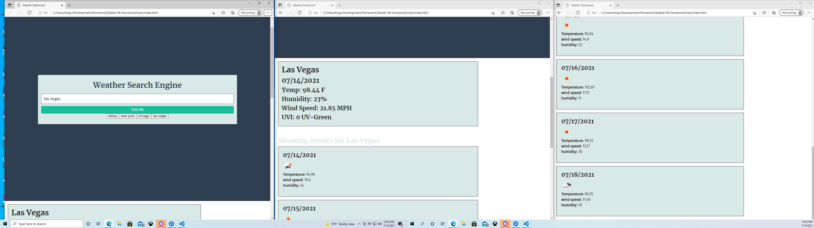

# Weather Dashboard


## Description


-The motivation behind this project was to create a weather dashboard where you could search a city and have returned to you the weather of that city that the 5 day forecast.
-This project definitely tested my ability to debug my own code and figure out what things worked in certains ways and why they did.  It was definitely a struggle, and took by far the most time of anything I've worked on thus far, plus scrapping my code and restarting after 3 days of work was a setback as well.
-The biggest problem I encountered in this project was getting the fetch requests to display their value when saved into a variable and then returned.  This was something I couldnt get to work, so I eventually changed up my code to make it work but ultimately led me to the right path.
-If I had an extra day or two, I would try to implement a colored icon for the UV index that had a pulse effect for days where I'd recommend less sun.


## User Story

```
AS A traveler
I WANT to see the weather outlook for multiple cities
SO THAT I can plan a trip accordingly
```

## Acceptance Criteria

```
GIVEN a weather dashboard with form inputs
WHEN I search for a city
THEN I am presented with current and future conditions for that city and that city is added to the search history
WHEN I view current weather conditions for that city
THEN I am presented with the city name, the date, an icon representation of weather conditions, the temperature, the humidity, the wind speed, and the UV index
WHEN I view the UV index
THEN I am presented with a color that indicates whether the conditions are favorable, moderate, or severe
WHEN I view future weather conditions for that city
THEN I am presented with a 5-day forecast that displays the date, an icon representation of weather conditions, the temperature, the wind speed, and the humidity
WHEN I click on a city in the search history
THEN I am again presented with current and future conditions for that city
```

## Mock-Up

The following image shows the web application's appearance and functionality:


https://kingcrowz.github.io/Zaleski-06-homework/

## Technologies used
-CSS
-HTML
-Javascript
-Moment
-Jquery
-googleapis
-Bootstrap
-Fontawesome


## Grading Requirements

